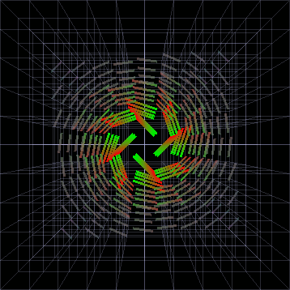

Flowtopia
========
A fluid dynamics repository that simply works.

<sub><sup>in special cases<sup><sub>

__Time evolution of a vortex with stationary boundaries:__ 


Dependencies
-------- 
freeglut

Installation
--------
This repository was built in Windows MinGW for GNU compatibility. The _freeglut_ library is freely available on other platforms.

**Windows:**
Download and install **MinGW** along with **MSYS** if and as required.

Open the MSYS console and download this repository:
```
git clone https://github.com/TeaHarvester/Flowtopia
```
Enter the root directory and compile from source:
```
cd Flowtopia
```
```
make
```